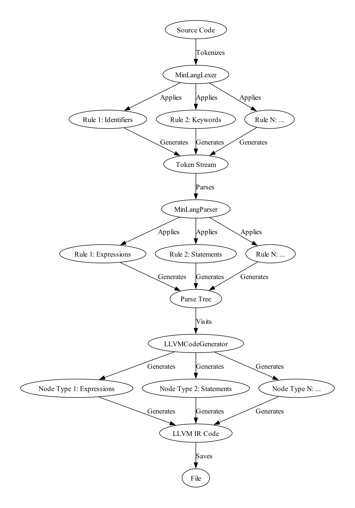

# Simple Language Compiler

  

Welcome to the Simple Language Compiler project! This endeavor aims to independently design a straightforward programming language and implement its compiler, covering all stages of source code processing up to the creation of machine code. The use of tools that facilitate the work of compiler developers is encouraged.

## Compiler Overview

The front end of the compiler, responsible for lexical-syntactic analysis, utilizes the powerful **ANTLR** analyzer generator or other similar tools. From the resulting **AST** (Abstract Syntax Tree), an intermediate representation (**IR**) adhering to the **LLVM** specification is generated. Subsequent stages involve optimizing the intermediate representation and generating machine code using the LLVM toolset.

  

## Stage 1: Simple Variable Operations

### Minimum Requirements:

- Support for two types of variables: integer, real.
- Basic support for standard input-output.
- Support for basic arithmetic operations.
- Identification of errors during lexical and syntactic analysis.

### Extensions:

- Support for array variables.
- Number matrix support.
- Support for logical values.
- Support for numbers with different precision (e.g., Float32, Float64).
- Support for the type of string (string).

## Stage 2: Program Flow Control

For the final defense of the project, prepare a printed **short manual** detailing the designed language. This manual should comprehensively describe the syntax, capabilities, and limitations from the user's perspective.

### Minimum Requirements:

- Conditional statements and loops.
- The ability to create functions.
- Variable scope support (local and global).

### Suggested Extensions:

- Support for structures.
- Class support.
- Dynamic typing (values in boxes).

# Installation

## Prerequisites

- Docker
- Visual Studio Code (VSCode)
- "ms-vscode-remote.remote-containers" extension in VSCode

## Setup

1. Install Docker.
2. Install Visual Studio Code (VSCode).
3. Install the "ms-vscode-remote.remote-containers" extension in VSCode.
4. Reload the window.
5. Accept the prompt to reopen in the development container.
6. Wait for the installation to complete; your patience will be rewarded.
7. Congratulations! Your development environment is now under your full control.

# How to Use

1. Clone the repository to your local machine.
2. Open the project in Visual Studio Code.
3. Follow the guidelines in the printed manual to understand the language syntax and features.
4. Write your Simple Language code in the designated files.
5. Use the provided Docker setup to compile and test your code.

# Pleasantries

Explore, contribute, and enjoy the journey of building with the Simple Language Compiler project. Happy coding!
